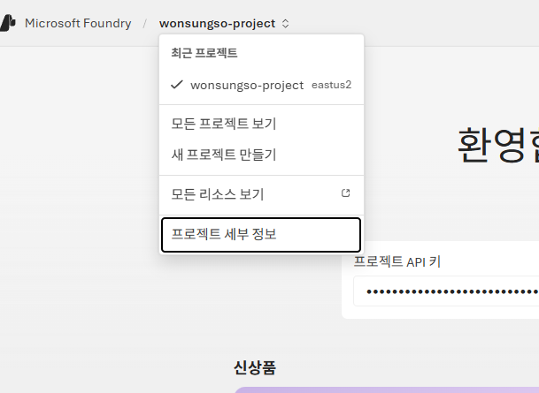
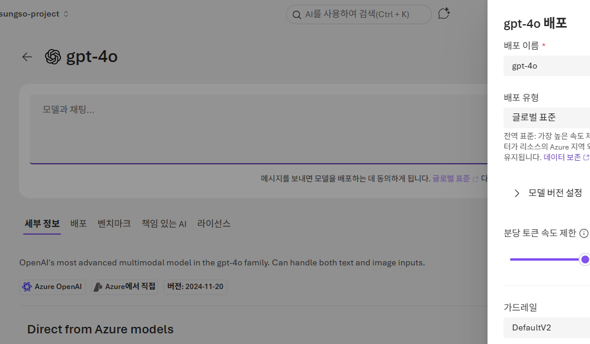
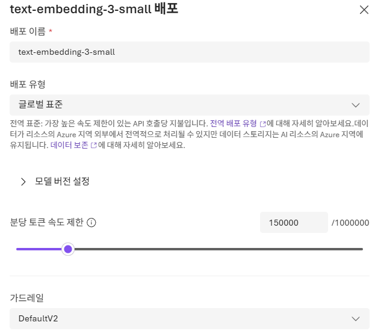

# Microsoft Foundry 구성

## Microsoft Foundry 구성

### 프로젝트 구성 및 정보 확인

1. [Microsoft Foundry 포털](https://ai.azure.com/)에 접속합니다.
확인합니다.
2. 홈 화면에서 `프로젝트 만들기`를 클릭합니다.
3. 프로젝트 이름을 입력합니다. 예시는 `<alias>-project` 형식을 사용합니다.
4. `고급 옵션`을 열고 지역을 `East US 2`로 선택합니다.
5. 나머지 옵션은 기본값으로 두고 `만들기`를 클릭합니다.
6. 프로젝트 생성이 완료될 때까지 잠시 기다립니다.
    
    
    
6. 프로젝트가 열리면 좌측 상단의 프로젝트 이름을 클릭합니다.
7. 드롭다운 메뉴에서 `프로젝트 세부 정보`를 클릭합니다.
8. 프로젝트 이름, 지역, 연결된 리소스를 확인합니다.
9. 이후 실습에서 반복해서 사용할 **리소스 그룹 이름**을 메모해 둡니다.
10. 필요하면 새 브라우저 탭에서 [Azure 포털](https://portal.azure.com)을 열고 같은 리소스 그룹이 생성되었는지 확인합니다.

    

### 모델 배포

1. [Microsoft Foundry 포털](https://ai.azure.com/)에 접속합니다.
2. 상단 메뉴의 `검색` 클릭 후 왼쪽 메뉴의 `모델`에서 모델을 찾습니다.
3. 검색창에서 `gpt-4o`를 검색하고 모델 카드를 엽니다.
4. `배포` > `사용자 지정 설정`을 클릭합니다.
5. 배포 이름은 기본값 `gpt-4o` 를 사용하여 배포합니다.
    
    

### 임베딩 모델 배포

1. 위와 동일하게 모델 리스트에서 `text-embedding-3-small`을 를 배포합니다.
    
    