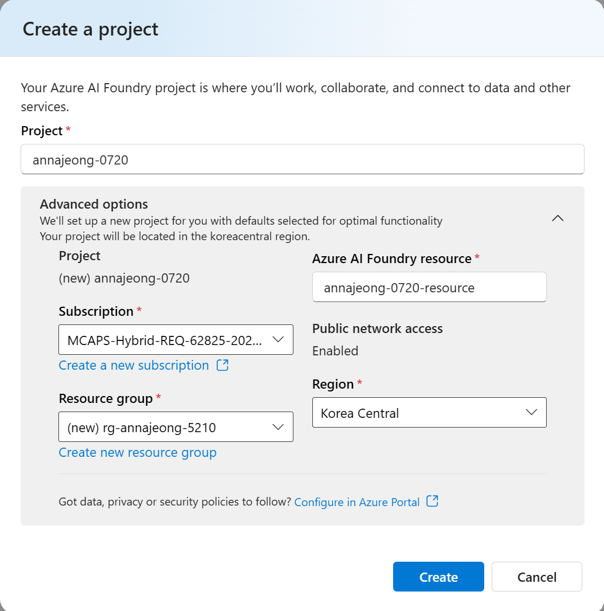

# Microsoft Foundry 구성

## Microsoft Foundry 구성

### 프로젝트 및 모델 구성

1. [Microsoft Foundry 포털](https://ai.azure.com/)에 로그인합니다.
2. 오른쪽 상단의 `Create new` 버튼을 클릭합니다.
3. `Microsoft Foundry resource`를 선택하고 `Next` 버튼을 클릭합니다.
4. `Project`에 `<alias>-<date>`를 입력합니다. (예: annajeong-0720)
5. Region을 `Korea Central`로 변경하고 `Create` 버튼을 클릭합니다.
    
    
    
6. 리소스 생성에는 약 2분이 소요됩니다. 생성이 완료되면 다음과 같은 프로젝트 화면이 나옵니다.
    
    
    
7. Microsoft Foundry 사용을 위한 사용자 권한을 할당하기 위해 상단의 `Fix me` 버튼을 클릭합니다.

### 모델 배포

1. 프로젝트 화면에서 왼쪽 메뉴 중 `Model + endpoints` 를 클릭하고, `+ Deploy model` 버튼을 클릭합니다.
2. `Deploy base model`을 선택합니다.
3. 모델 리스트에서 `gpt-4o`를 선택하고 `Confirm` 버튼을 클릭합니다.
4. 아래 내용을 확인하고 `Deploy` 버튼을 클릭합니다.
    
    

### 임베딩 모델 배포

1. 위와 동일하게 `Model + endpoints`에서 `+ Deploy model` 버튼을 클릭합니다.
2. 모델 리스트에서 `text-embedding-3-small`을 선택하고 `Confirm` 버튼을 클릭합니다.
    
    
    
3. `Deploy` 버튼을 클릭하여 모델 배포를 완료합니다.