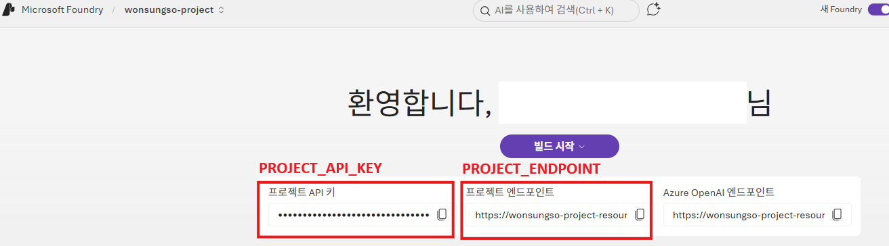
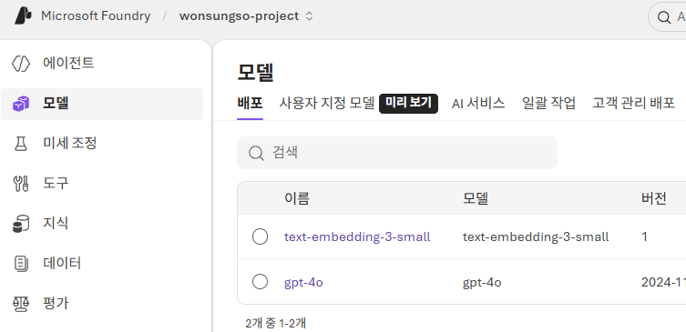

# 인증 정보 구성

1. VS Code 터미널에서 아래 명령어를 실행합니다.
    
    ```bash
    cp .env.example .env
    ```
    
2. [`Microsoft Foundry 포털`](https://ai.azure.com/)에 접속하여 생성한 프로젝트를 클릭한 뒤 다음 정보를 복사/붙여넣기 하여, 아래와 같이 `.env 파일`을 구성합니다.
    
    
    
    ```bash
    PROJECT_ENDPOINT="https://<resource>.services.ai.azure.com/api/projects/<project_name>"
    PROJECT_API_KEY="<project-api-key>"
    ```


3. 생성한 `LLM 모델`과 `임베딩 모델`을 `.env` 파일에 업데이트합니다.
    
    ```bash
    MODEL_NAME="gpt-4o"
    TEXT_EMBEDDING_MODEL="text-embedding-3-small"
    ```

    