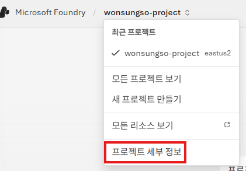
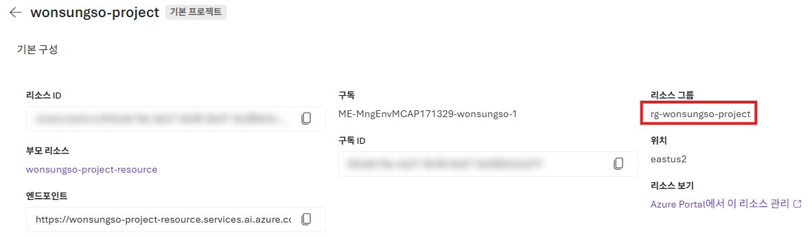
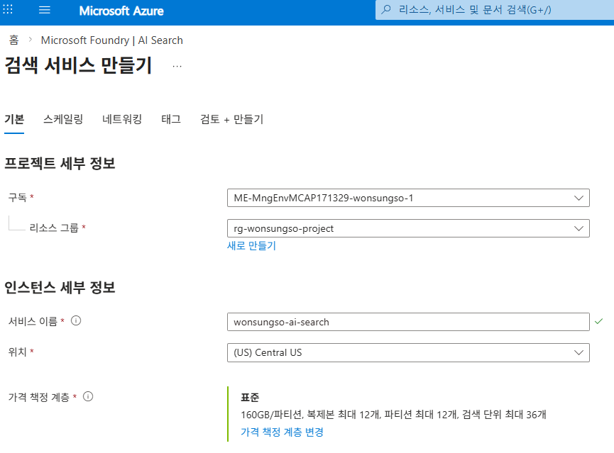
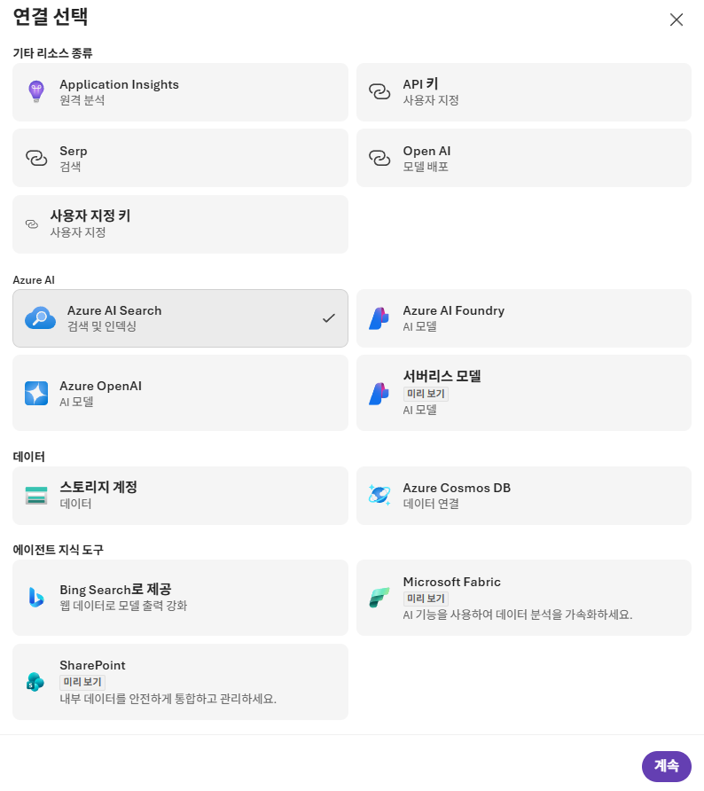
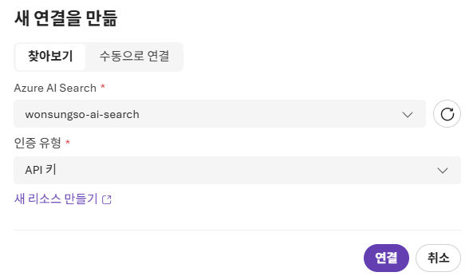
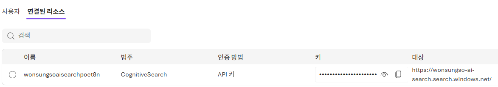
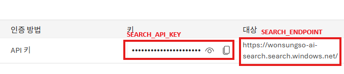

# Azure AI Search 구성 및 노트북 실습

## Azure AI Search 생성

1. `Microsoft Foundry`에서 생성한 프로젝트의 세부 정보를 클릭합니다.
    
    
    
2. `Resource group`을 기록해 둡니다.

    

3. 브라우저의 새 탭에서 [`Azure Portal`](https://portal.azure.com/)에 접속합니다.
4. 상단 메뉴 검색창에 `AI 검색`을 입력합니다.
5. `Microsoft Foundry | AI Search` 화면에서 `+ 만들기` 버튼을 클릭합니다.
6. `구독`을 선택하고 기록한 `리소스 그룹`을 선택하고 아래와 같이 구성합니다.
    - 서비스 이름 : `<alias>-ai-search`
    - 위치 : `(US) Central US`
    - 가격 책정 계층은 `Standard(표준)` 으로 둡니다.
7. 나머지 설정은 그대로 두고 `검토 + 만들기` 버튼을 클릭하고 `만들기` 버튼을 클릭하여 리소스를 생성합니다.



## Microsoft Foundry 및 Azure AI Search 연걸

1. [`Microsoft Foundry 포털`](https://ai.azure.com/)로 이동합니다.
2. 프로젝트 화면 상단 우측 메뉴의 `작업`를 클릭한 후 좌측 메뉴의 `관리자`를 선택합니다.
3. 프로젝트의 상세 정보 화면에서 `연결된 리소스` 메뉴를 클릭 한 후 `연결 추가` 버튼을 클릭합니다.
3. 왼쪽 메뉴 `리소스`에서 `Connected resources`를 클릭하고 `+ 새 연결` 버튼을 클릭합니다.
4. `Azure AI Search`를 선택한 후 `계속` 버튼을 클릭합니다.

    

5. 리스트에서 생성한 `<alias>-ai-search`를 선택한 후 `연결` 버튼을 클릭합니다.
    
    
    
6. `연결된 리소스` 의 목록을 확인합니다.

    

### AI Search 연결 구성 후

1. 동일 메뉴에서 `키` / `대상` 값을 복사하여 아래와 같이 `.env 파일`을 업데이트 합니다.
    
    
    
    ```bash
    SEARCH_INDEX_NAME="healthtips-index"
    SEARCH_ENDPOINT=<search-endpoint>
    SEARCH_API_KEY=<search-api-key>
    ```

### 노트북 실행

다음의 노트북을 차례대로 실습 합니다.
* [1-basic-chat-completion.ipynb](./1-basic-chat-completion.ipynb) 
* [2-embeddings.ipynb](./2-embeddings.ipynb)
* [3-basic-rag.ipynb](./3-basic-rag.ipynb)